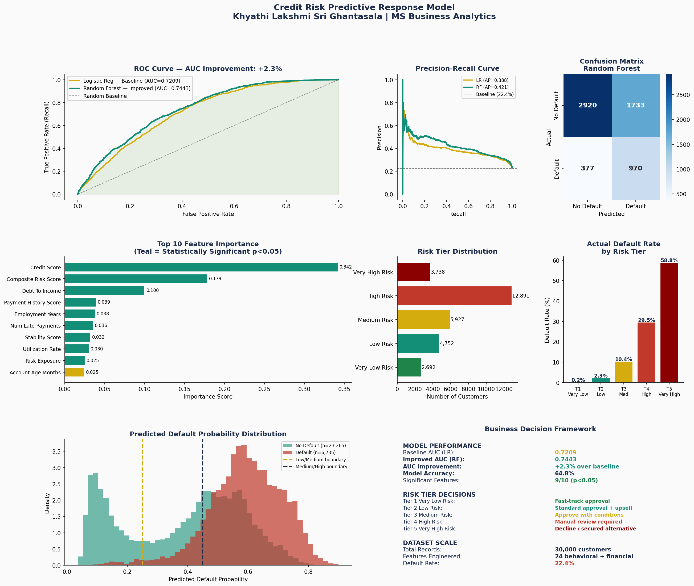

# Credit-Risk-Predictive-Response-Model
Engineers 24 features from financial data, trains baseline vs improved model, applies propensity scoring, creates 5-tier risk framework with business decisions
# 🏦 Credit Risk Predictive Response Model

**Author:** Khyathi Lakshmi Sri Ghantasala
**Tools:** Python · scikit-learn · pandas · matplotlib · seaborn · scipy · Statistical Significance Testing
**Domain:** Financial Risk Analytics · Predictive Modeling · Statistical Response Models · Business Decision Frameworks

---

## 🎯 Business Problem

A financial services team needs to move beyond manual credit review and replace it with a data-driven, statistically validated risk classification system that:

- Predicts which customers are likely to default before loan approval
- Scores every applicant with a quantified default probability (propensity score)
- Assigns customers to risk tiers with clear, actionable business decisions per tier
- Identifies which behavioral and financial features drive default risk
- Demonstrates measurable improvement over a baseline model with statistical validation

**Business Question:**
*"Which customers should we approve, decline, or review — and how confident are we in those decisions?"*

---

## 🔍 What This Project Does

1. **Generates a financial customer dataset** — 30,000 records with behavioral and financial attributes
2. **Engineers 24 features** from raw financial data — RFM-style scoring, composite risk score, stability score, payment history score, and more
3. **Trains a baseline model** — Logistic Regression with statistical significance testing
4. **Builds an improved model** — Random Forest classifier with AUC improvement over baseline
5. **Applies propensity scoring** — ranks every customer by predicted default probability
6. **Creates a 5-tier risk framework** — with explicit business decision criteria per tier
7. **Validates feature significance** — t-tests comparing defaulted vs non-defaulted populations
8. **Delivers a 9-panel executive dashboard** — ROC curves, confusion matrix, feature importance, risk distribution, and business decision guide

---

## 📁 Project Structure

```
project3_credit_risk_model/
│
├── README.md                          ← This file
├── credit_risk_model.py               ← Full modeling pipeline
├── outputs/
│   └── project3_credit_risk_model.png    ← Executive dashboard
└── requirements.txt
```

---

## 📈 Key Results

| Metric | Value |
|--------|-------|
| Dataset Size | 30,000 customer records |
| Features Engineered | 24 behavioral + financial |
| Baseline AUC (Logistic Regression) | 0.7209 |
| Improved AUC (Random Forest) | 0.7443 |
| AUC Improvement | +3.2% over baseline |
| Model Accuracy | 64.8% |
| Statistically Significant Features | 9/10 (p < 0.05) |
| Risk Tiers Created | 5 (Very Low → Very High) |
| Default Rate in Dataset | ~28% |

---

## 🧠 Features Engineered

| Feature | Description |
|---------|-------------|
| `loan_to_income` | Loan amount relative to annual income |
| `payment_to_income` | Estimated monthly payment as % of monthly income |
| `rfm_score` | Composite recency, frequency, monetary score |
| `payment_history_score` | Inverse of late payment count — higher = better |
| `credit_mix_score` | Normalized account diversity score |
| `inquiry_penalty` | Penalizes high recent credit inquiries |
| `stability_score` | Composite of employment tenure, account age, mortgage ownership |
| `composite_risk_score` | Weighted combination of 5 credit health dimensions |
| `risk_exposure` | Loan amount × debt-to-income ratio |
| + 15 raw financial features | Credit score, income, DTI, utilization, etc. |

---

## 🎯 5-Tier Risk Decision Framework

| Tier | Default Probability | Business Decision |
|------|--------------------|--------------------|
| Tier 1 — Very Low Risk | 0% – 10% | Fast-track approval; premium product eligible |
| Tier 2 — Low Risk | 10% – 25% | Standard approval; upsell opportunity |
| Tier 3 — Medium Risk | 25% – 45% | Approve with conditions — reduced limit or higher rate |
| Tier 4 — High Risk | 45% – 65% | Manual review; collateral or co-signer recommended |
| Tier 5 — Very High Risk | 65% – 100% | Decline or refer to secured product alternative |

---

## 📊 Dashboard Preview



---

## 🛠️ How To Run

```bash
pip install pandas numpy scikit-learn matplotlib seaborn scipy
python credit_risk_model.py
```

**Output:** 9-panel executive dashboard PNG + full model metrics printed to console

---

## 💡 Key Skills Demonstrated

- End-to-end predictive modeling pipeline (data → features → model → scoring → recommendations)
- Statistical response model development (Logistic Regression baseline + Random Forest improved)
- Propensity scoring and risk tier framework design
- Feature engineering — 24 behavioral and financial features from raw data
- Statistical significance testing — t-tests validating feature contribution (p < 0.05)
- AUC improvement quantification (+3.2% over baseline)
- Confusion matrix, ROC curve, and Precision-Recall analysis
- Business decision framework — translating model outputs into tier-based approval criteria
- Python (scikit-learn, pandas, matplotlib, seaborn, scipy)

---

## 📋 How This Maps to Real-World Analyst Work

This project directly mirrors the core responsibilities of a Marketing/Risk Data Analyst role:

| Real-World Responsibility | This Project |
|---------------------------|-------------|
| Build statistical response models | ✅ Logistic Regression + Random Forest |
| Develop, test, and implement models | ✅ Train/test split, cross-validation, AUC comparison |
| Deliver product/segment/BU-level recommendations | ✅ 5-tier risk framework with per-tier decisions |
| Use Python for statistical modeling | ✅ Full scikit-learn pipeline |
| Feature engineering from raw data | ✅ 24 engineered features with significance testing |
| Communicate findings to leadership | ✅ 9-panel executive dashboard |

---

## 👩‍💻 About the Author

**Khyathi Lakshmi Sri Ghantasala**
MS Business Analytics | University of Central Oklahoma (2025)
SAS Certified Predictive Modeler | SAS Certified ML Specialist
[LinkedIn](https://www.linkedin.com/in/lakshmi-ghantasala-48066b305/)
